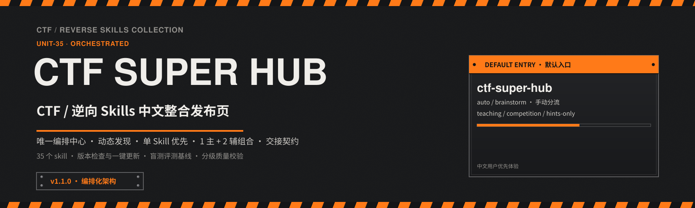
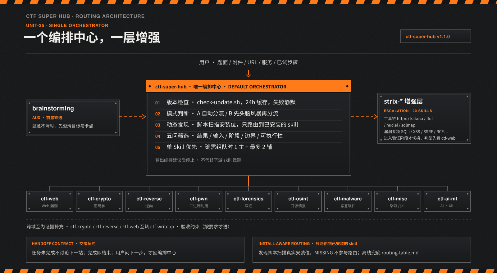
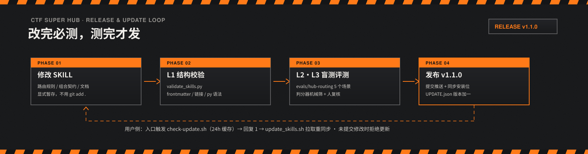

<div align="center">

<p>
  
</p>

# CTF Super Hub / CTF Skills 小白整合包

**给小白用户准备的一套 CTF / 逆向题目统一入口。**

如果你经常遇到这些问题：

**题目不会分类、skill 不知道怎么选、第一步不知道该做什么。**

那这个仓库就是为你准备的。

<p>
  <a href="./START-HERE.md">快速开始</a> ·
  <a href="./SKILL-INDEX.md">技能索引</a> ·
  <a href="./docs/USAGE.md">使用说明</a> ·
  <a href="./docs/LINUXDO.md">LinuxDo 社区</a>
</p>

<p>
  
  
  
  
  
</p>

</div>

---

## 目录导航

- [这是什么](#这是什么)
- [先用一句话理解 skill](#先用一句话理解-skill)
- [它能帮你解决什么问题](#它能帮你解决什么问题)
- [如果你是第一次接触先看这里](#如果你是第一次接触先看这里)
- [先记住两个入口就够了](#先记住两个入口就够了)
- [它到底怎么工作](#它到底怎么工作)
- [3 分钟快速上手](#3-分钟快速上手)
- [安装前先准备什么](#安装前先准备什么)
- [安装](#安装)
- [安装成功怎么确认](#安装成功怎么确认)
- [安装后怎么用](#安装后怎么用)
- [升级与版本检查](#升级与版本检查)
- [质量保障](#质量保障)
- [常见问题小白版](#常见问题小白版)
- [仓库结构](#仓库结构)
- [文档导航](#文档导航)
- [校验](#校验)
- [加入社区共建生态](#加入社区共建生态)

---

## 这是什么

这不是一份“把很多 skill 堆在一起”的目录。

这是一个 **面向小白用户的 CTF / 逆向统一入口**。

它真正解决的问题是：

> 不是你没有工具，而是你拿到题以后，常常不知道第一步该怎么办。

这个仓库把一组 CTF / 逆向相关 skill 按“先开始做题”这件事重新组织了一次，让你可以：

- 先用总入口判断题型
- 看不懂题时先头脑风暴
- 再自动路由到更合适的专项 skill
- 做到一半发现题型判断错了，也能继续切换方向
- 最后还能接到 writeup 产出

如果你是第一次接触这类仓库，也不用担心。

你可以把它理解成：

> **一套给 AI 用的做题说明书 + 路由器。**

你不用先研究完所有目录，也不用先记住所有 skill 名字。
大多数时候，你只要先会用 `ctf-super-hub` 就够了。

---

## 先用一句话理解 skill

很多新手第一次看到 `skill` 会有点懵。

这里直接说人话：

> **skill 就是一份“让 AI 按某种方法工作”的说明书。**

它不是题库，不是插件商城，也不是必须自己手写代码才能运行的东西。

你可以把它理解成：

- 你发一句提示词
- AI 读到对应 skill
- 然后按这份 skill 规定的流程来帮你分析、拆题、推进

所以你不用先关心 skill 里面的细节怎么写。
**先会调用，先把题做起来，最重要。**

---

## 它能帮你解决什么问题

如果你有过这些情况，这个仓库会很有用：

- 拿到一道题，分不清是 Web / Crypto / Reverse / Pwn / Misc
- 看见很多 skill 名字，但不知道先调用哪个
- 知道自己要做题，但完全不知道第一条命令该敲什么
- 想让 AI 带着你一步一步做，而不是一上来就丢一堆术语
- 想要“教学模式”或“比赛模式”，而不是永远只有一种输出方式

一句话总结：

> 这套仓库不是教你先研究体系，而是帮你先把题做起来。

---

## 如果你是第一次接触先看这里

如果你完全是小白，建议按这个顺序走，不容易乱：

### 第 1 步：先安装

把这些 skill 文件夹放进你的 AI 工具能读取的 skills 目录。

### 第 2 步：新开一个会话

不要在一个已经聊了很久、话题很多的旧会话里测试。
**新会话最稳。**

### 第 3 步：直接用主入口

把下面这段话复制进去：

```text
请使用 ctf-super-hub 帮我处理这道题。
如果你能判断题型，就自动分流到最合适的 ctf-* skill。
如果信息还不够，就先带我做最小化头脑风暴。
默认用 teaching 风格输出。
```

### 第 4 步：把你手头材料贴给 AI

你不需要一次就整理得很专业。
有多少给多少就行，例如：

- 题面
- 网站地址
- IP:PORT
- 附件
- 源码
- 二进制文件信息
- 你已经试过的命令
- 你卡住的地方

### 第 5 步：跟着它给你的下一步做

你不需要一下子把整题看懂。
这个仓库的目标，本来就是帮你解决“第一步不知道做什么”的问题。

---

## 先记住两个入口就够了

### 1. `ctf-super-hub`（默认推荐）

如果你只打算记一个名字，就记它。

它是整个仓库的**唯一编排中心**，会帮你：

- 自动判断题目更像哪一类
- 信息不够时，先带你做最小化头脑风暴
- 在 `teaching / competition / hints-only` 三种风格间切换
- 动态扫描已安装的 skill，只路由到真实可用的那些
- 需要时增强到 `strix-*` 做 Web / 接口 / 漏洞验证动作
- 需要组队时，按「1 主 + 最多 2 辅」编排，角色分工清楚

适合：**绝大多数人、绝大多数题目、绝大多数第一次使用场景。**

### 2. `ctf-beginner-hub`（更适合纯新手）

如果你是刚接触 CTF，或者不喜欢太多术语，可以先用它。

它是主入口的**新手变体**：路由规则完全同源，但表达更温和，
先给一段新手教程，术语全部带人话解释。

适合：

- 第一次接触这套仓库
- 想少一点压迫感
- 想先把题目讲明白，再开始动手

---

## 它到底怎么工作

<p>
  
</p>

你可以把它理解成两种模式。

### 模式 1：自动分流

适合你已经有这些材料的时候：

- 题面
- 附件
- URL
- IP:PORT
- 源码
- 可执行文件 / 二进制

它会做三件事：

1. 先判断这题最像哪一类
2. 再决定要不要切到更具体的 `ctf-*` 或 `strix-*`
3. 只告诉你接下来最值得做的 1~3 步

### 模式 2：先头脑风暴，再分流

适合这些情况：

- 你根本没看懂题目在说什么
- 你不知道自己手里的材料够不够
- 你不知道接下来该补什么信息

它会做三件事：

1. 先帮你梳理目标
2. 再整理线索和缺失信息
3. 最后再决定应该调用哪个 skill

### `strix-*` 是什么

你可以把它理解成 **增强层**，不是第二套主系统。

也就是说：

- `ctf-super-hub` / `ctf-beginner-hub` 负责主流程
- `strix-*` 只在 Web、接口、漏洞验证这类动作里增强执行

所以你平时不用先记住一堆 `strix-*` 名字。

大多数时候，**直接从 `ctf-super-hub` 开始就够了。**

### 两条契约，保证它不会跑偏

- **交接契约**：每个 skill 任务没做完不讨论下一站；做完就结束；
  只有你明确问“下一步呢”，才回到编排中心重新分流。不会自作主张连跑一串 skill。
- **安装感知路由**：编排中心每次先扫描你机器上真实安装了哪些 skill，
  没装的一律不进候选，不会推荐一个你根本没装的 skill。

---

## 3 分钟快速上手

如果你现在就想开始，用下面这些提示词直接试。

### 用法 1：默认推荐

```text
请使用 ctf-super-hub 帮我处理这道题。
如果你能判断题型，就自动分流到最合适的 ctf-* skill。
如果信息还不够，就先带我做最小化头脑风暴。
默认用 teaching 风格输出。

题目信息：
[粘贴题面/附件/URL/IP:PORT/源码结构/已做尝试]
```

### 用法 2：比赛模式

```text
请使用 ctf-super-hub 的 auto + competition 模式。
先判断最像哪类题，再只告诉我接下来最该做的 1~3 步。

题目信息：
[粘贴内容]
```

### 用法 3：只想要提示

```text
请使用 ctf-super-hub 的 auto + hints-only 模式。
不要直接把解法全展开，只告诉我下一步该查什么、为什么。

题目信息：
[粘贴内容]
```

### 用法 4：我完全看不懂题

```text
请使用 ctf-super-hub 的 brainstorm + teaching 模式。
我现在看不懂这题是什么类型。
先帮我梳理目标、线索、缺失信息，再决定自动路由还是手动路由。

题目信息：
[粘贴内容]
```

---

## 安装前先准备什么

如果你是第一次装这类东西，先确认下面 3 件事：

### 1. 你已经把仓库下载到本地

如果你会用 Git：

```bash
git clone https://github.com/asdfgh1445/ctf-super-hub.git
cd ctf-super-hub
```

如果你不会用 Git，也没关系：

1. 在 GitHub 页面下载 ZIP
2. 解压
3. 进入解压后的 `ctf-super-hub` 目录

> 注意：skill 文件夹就在仓库根目录下（`ctf-*`、`strix-*`、`solve-challenge`、
> `brainstorming`），没有额外的子目录，直接在仓库根目录执行下面的复制命令即可。

### 2. 你知道自己要装到哪个 AI 工具里

这份 README 下面直接给你 4 种常见装法：

- Codex
- Claude Code
- Gemini CLI
- OpenCode

你只需要照着自己正在用的那个装就行。
**不用四个都装。**

### 3. 你知道什么叫“进入目录”

后面的命令经常会先让你执行：

```bash
cd ctf-super-hub
```

它的意思不是安装，而是：

> **先让终端切换到这个仓库的根目录。**

如果你没切进去，后面的复制命令很容易报错。

---

## 安装

如果你完全没经验，按下面这个顺序做最稳：

1. 下载仓库
2. 进入仓库根目录
3. 选择你正在用的 AI 工具
4. 执行对应那一段命令
5. 重启工具，或者新开一个会话

---

### 1. Codex 安装方式（最省事）

这是最推荐的安装方式，因为仓库已经内置脚本了。

先进入仓库根目录：

```bash
cd /path/to/ctf-super-hub
```

然后执行：

```bash
./install-to-codex.sh
```

默认会安装到：

```bash
~/.codex/skills
```

如果你想装到自定义目录：

```bash
./install-to-codex.sh /path/to/your/skills-dir
```

这条脚本会自动：

- 创建目标目录
- 如果已有同名 skill，先做备份
- 把仓库里的相关 skill 复制过去

如果你是小白，**优先用这个方法**，最不容易出错。

---

### 2. Claude Code 安装方式

如果你的 Claude Code 使用本地 skills 目录，可以直接手动复制。

常见目录示例：

```bash
~/.claude/skills
```

安装步骤（在仓库根目录执行）：

```bash
mkdir -p ~/.claude/skills
cp -R brainstorming solve-challenge ctf-* strix-* ~/.claude/skills/
```

说明：

- `mkdir -p`：如果目录不存在，就先创建
- `cp -R ...`：把这些 skill 文件夹复制过去

如果你的 Claude Code 用的是别的自定义 skills 路径，把最后的 `~/.claude/skills/` 换成你自己的目录即可。

安装后建议：

- 关闭 Claude Code 再重新打开
- 或至少新开一个会话

---

### 3. Gemini CLI 安装方式

Gemini CLI 如果支持本地 skills 目录，常见示例可以放在：

```bash
~/.gemini/skills
```

安装步骤（在仓库根目录执行）：

```bash
mkdir -p ~/.gemini/skills
cp -R brainstorming solve-challenge ctf-* strix-* ~/.gemini/skills/
```

如果你本地已经给 Gemini CLI 配过别的 skills 路径，就把目标目录替换成你自己的实际路径。

安装后建议：

- 重新打开 Gemini CLI
- 或新开一个会话
- 然后直接测试 `ctf-super-hub`

---

### 4. OpenCode 安装方式

OpenCode 的 skills 目录在不同版本、不同发行方式下可能不完全一样。
所以这里给你一个**常见目录写法**：

```bash
~/.opencode/skills
```

安装步骤（在仓库根目录执行）：

```bash
mkdir -p ~/.opencode/skills
cp -R brainstorming solve-challenge ctf-* strix-* ~/.opencode/skills/
```

如果你的 OpenCode 实际不是这个目录，也没关系。
你只需要把命令最后的 `~/.opencode/skills/` 替换成你自己的实际目录即可。

你真正要记住的是这句话：

> 把这些 skill 文件夹复制到 OpenCode 能识别的 skills 目录里，就可以了。

---

## 安装成功怎么确认

很多新手不是装错了，而是不知道怎么确认自己到底装成功没有。

你可以按下面 3 种方式检查。

### 方式 1：直接看目录里有没有 `ctf-super-hub`

例如：

```bash
ls ~/.codex/skills/ctf-super-hub
```

或者：

```bash
ls ~/.claude/skills/ctf-super-hub
ls ~/.gemini/skills/ctf-super-hub
ls ~/.opencode/skills/ctf-super-hub
```

如果能看到里面的 `SKILL.md`，通常就说明复制成功了。

### 方式 2：新开会话，直接测试主入口

把这段话发给你的 AI 工具：

```text
请使用 ctf-super-hub 帮我处理这道题。
题面：这是一个测试，不需要真正解题，只要确认你能正确进入 ctf-super-hub 的工作方式。
```

如果它开始按“判断题型 / 分流 / 教学模式”这类方式回应，通常就说明已经生效了。

### 方式 3：如果没生效，先排查这 3 件事

1. 你是不是复制到了错误目录
2. 你是不是没有重启工具 / 没开新会话
3. 你执行 `cp -R ...` 时，其实不在仓库根目录里

特别是第 3 条，非常常见。

如果你用的是 zsh，报出类似：

```bash
no matches found: ctf-*
```

通常说明你当前目录不对。
先 `cd /path/to/ctf-super-hub` 再重试。

---

## 安装后怎么用

安装完成后，不需要先把所有 skill 全看一遍。

最简单的方式就是：

### 第一步：直接调用主入口

```text
请使用 ctf-super-hub 帮我处理这道题。
```

### 第二步：把你手头有的材料贴进去

例如：

- 题面
- 附件说明
- 网站地址
- IP 和端口
- 文件列表
- 你已经试过的命令
- 你卡住的地方

### 第三步：选择你想要的输出风格

你可以这样说：

- `teaching`：适合学习，讲解会更多
- `competition`：适合比赛，强调快速推进
- `hints-only`：适合你想自己做，只要提示

如果你不知道选哪个，**默认先用 `teaching` 就行。**

### 第四步：如果它说信息不够，就继续补材料

这很正常，不代表它没工作。

比如你可以继续补：

- 网站返回内容
- 报错信息
- `file` / `strings` / `checksec` 输出
- 目录结构
- HTTP 请求与响应
- 你做过但失败的尝试

很多题不是“一次贴全资料”才能做，而是边做边补信息。

---

## 升级与版本检查

v1.1.0 之后，主入口自带版本检查，不需要你盯仓库。

<p>
  
</p>

工作方式：

- 每次进入 `ctf-super-hub`，它会自动跑一次版本检查
  （读取仓库里的 `UPDATE.json`，**24 小时内只发一次网络请求**，失败静默不影响使用）
- 有新版本时，回复末尾会出现一条 `🔔` 提醒，带版本号和更新说明
- 你**紧接着回复 `1`**，它就自动执行更新脚本：拉取仓库 + 重新同步全部 skill
- 你本地改过 skill 有未提交修改时，更新脚本会**拒绝执行**并列出文件清单，
  不会覆盖你自己的改动——先提交或 stash，再更新

也可以手动更新：

```bash
bash ~/.codex/skills/ctf-super-hub/scripts/update_skills.sh --dry-run   # 先看会做什么
bash ~/.codex/skills/ctf-super-hub/scripts/update_skills.sh             # 真正执行
```

---

## 质量保障

这个仓库对 skill 质量有分级校验，不是“能跑就行”：

- **L1 结构校验**：`python3 scripts/validate_skills.py`
  检查全部 35 个 skill 的 frontmatter、description 触发名、文内相对链接、
  Python 脚本语法、仓库关键文件；支持 `--json` 接 CI
- **L2 行为冒烟 / L3 留出回归**：`evals/hub-routing/` 内置 5 个盲测场景
  （RSA 分类、SQLi 增强、OSINT 反例、组合编排、reverse/pwn 留出），
  由不知道预期答案的执行者真实跑路由，再用判分器 + 人复核打分；
  每次改动路由规则后全量重跑，fixtures 就是回归基线
- **轻量化审计**：叶子 skill 的瘦身原则与结论记录在
  [`docs/skill-weight-audit.md`](./docs/skill-weight-audit.md)

---

## 常见问题小白版

### Q1：我一定要先懂题型分类吗？

不用。

如果你不会分类，直接用：

```text
请使用 ctf-super-hub 帮我处理这道题。
```

它本来就是为“不会分类的人”准备的。

### Q2：我必须把所有 skill 名字都背下来吗？

不用。

大多数情况下，你只要先记住：

- `ctf-super-hub`
- `ctf-beginner-hub`

就够了。编排中心自己会扫描你装了哪些 skill。

### Q3：我只想学习，不想 AI 一口气把答案说完，怎么办？

用：

- `teaching`
- `hints-only`

这两种风格更适合学习。

### Q4：我只装主入口，不装其他 `ctf-*` / `strix-*` 行不行？

不太建议。

因为主入口的价值之一，就是能自动分流到其他专项 skill。
你只装一个入口，很多路由能力就用不上了（而且它是安装感知的——
没装的 skill 它不会推荐，能力就空转了）。

最稳妥的做法还是：

> 把 `brainstorming`、`solve-challenge`、`ctf-*`、`strix-*` 一起复制过去。

### Q5：我题目只有一个网址 / 一个压缩包 / 一个 ELF，也能用吗？

可以。

你不用等“信息整理得很完整”再开始。
你现在手里有什么，就先给什么。

### Q6：它回复我说还需要更多信息，是不是装坏了？

不是。

这通常说明它已经开始工作了，只是题目确实还缺关键材料。

### Q7：我到底应该用 `ctf-super-hub` 还是 `ctf-beginner-hub`？

如果你拿不准，默认用 `ctf-super-hub`。

如果你是纯新手、容易被术语劝退，就先用 `ctf-beginner-hub`。

### Q8：回复 `1` 会不会误触发更新？

不会。只有在你**刚收到 `🔔` 版本提醒之后**紧接着回复 `1`，
它才会当作“确认更新”。没有提醒时，`1` 就是普通消息。

---

## 仓库结构

如果你只是来使用，这一节其实不用全部看懂。

大概知道这些就够了：

```text
.
├── README.md
├── START-HERE.md
├── SKILL-INDEX.md          # 技能索引 + 全套 skill 共同遵守的编排契约
├── UPDATE.json             # 版本检查读取的官方版本文件
├── install-to-codex.sh
├── scripts/
│   ├── install_ctf_tools.sh
│   └── validate_skills.py  # L1 结构校验（frontmatter/链接/语法，--json 可接 CI）
├── evals/
│   └── hub-routing/        # 盲测路由评测：场景、判分器、fixtures 回归基线
├── docs/
│   ├── USAGE.md
│   ├── PUBLISHING.md
│   ├── LOCALIZATION.md
│   ├── LINUXDO.md
│   └── skill-weight-audit.md
├── ctf-super-hub/          # 唯一编排中心（默认推荐）
│   └── scripts/            #   动态发现 / 版本检查 / 更新脚本
├── ctf-beginner-hub/       # 新手入口（主入口的新手变体）
├── solve-challenge/        # 自动求解执行器
├── brainstorming/          # 先理清题意
├── ctf-*/                  # 各题型专项 skill
└── strix-*/                # Web / 接口 / 漏洞验证增强层
```

你真的需要先关心的，通常只有：

- `ctf-super-hub`
- `ctf-beginner-hub`
- `START-HERE.md`

---

## 文档导航

- [`START-HERE.md`](./START-HERE.md)：最快上手，建议先看
- [`SKILL-INDEX.md`](./SKILL-INDEX.md)：所有 skill 的索引 + 编排契约
- [`docs/USAGE.md`](./docs/USAGE.md)：更完整的使用说明
- [`docs/LINUXDO.md`](./docs/LINUXDO.md)：LinuxDo 发帖与小白社区建议
- [`docs/PUBLISHING.md`](./docs/PUBLISHING.md)：GitHub 发布前检查清单
- [`docs/LOCALIZATION.md`](./docs/LOCALIZATION.md)：汉化策略与约定
- [`docs/skill-weight-audit.md`](./docs/skill-weight-audit.md)：叶子 skill 轻量化审计

---

## 校验

如果你改过仓库内容，或者想确认结构没坏，可以运行：

```bash
python3 scripts/validate_skills.py
```

它会检查：

- 关键仓库文件是否存在
- 全部 skill 的 frontmatter 与 description 触发名
- 每个 SKILL.md 里的相对链接是否有效
- skill 内置 Python 脚本是否能通过语法编译
- 主入口和关键参考文件是否完整

改了路由规则后，跑盲测回归：

```bash
python3 evals/hub-routing/check_contracts.py
```

同时仓库也带了 GitHub Actions：

- `.github/workflows/validate.yml`

---

## 加入社区共建生态

如果你认同这件事，欢迎一起把它做成小白用户真正会用的 CTF / 逆向技能入口。

你可以这样参与：

- 在 **GitHub** 提 issue / PR：补文档、补规则、补用例、补 skill
- 在 **LinuxDo** 反馈体验：说清楚哪一步最卡、哪类题最难上手、哪里最该优化
- 把你的真实使用场景发出来：优先优化最常见、最刚需的部分

<p align="center">
  <a href="https://github.com/asdfgh1445/ctf-super-hub">
    
  </a>
  &nbsp;
  <a href="https://linux.do">
    
  </a>
</p>

<p align="center">
  <i>这个项目真正解决的，不是“skill 不够多”，而是“小白用户的第一步总是最难开始”。</i>
</p>
